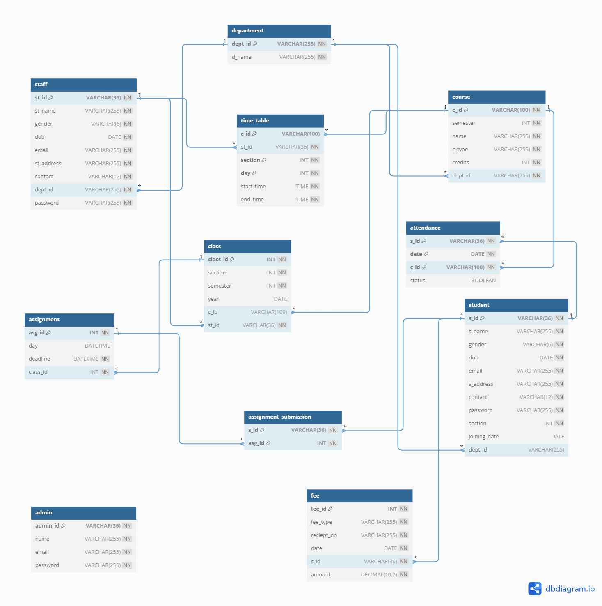
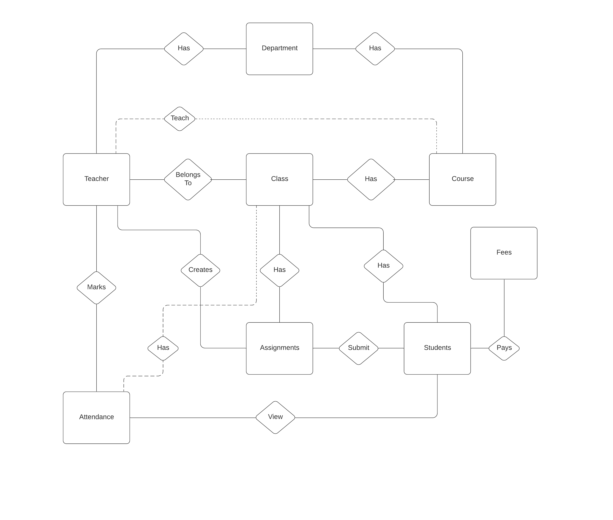

# cms_DBMS
🏰 A College Management Site (DBMS) using Node and Mysql.

## Product Features and User Classifications

There are several types of end users for the CMS. They are broadly divided as Students, Staff and the Administrator. Each of these classes have their own set of features

- **ADMIN** who can view and edit the details of any students/staff. Can add/edit departments, courses, classes and time-tables.
- **STAFF** who can view students details, add/update assignments, marks and attendance of a particular student.   They can see the time-table of a particular class also.
- **STUDENT** who can update profile/ add solution to assignments and see marks/attendance.

### UseCase Diagram 

This is the use case diagram which depicts the user’s interaction with the system. It also shows the relationship between the user and the different use cases in which the user is involved.

### Database Design 

We are using MySQL as our database. The main objective of this project is to use Relational Database and hence MySQL is the best choice for that. 

*User can perform the above operations without writing any database query by using our simple and convenient User Interface.*

**CLASS DIAGRAM**

**ER MODEL**

### 3-tier Architecture

-------------------------------------------------------------------------------

